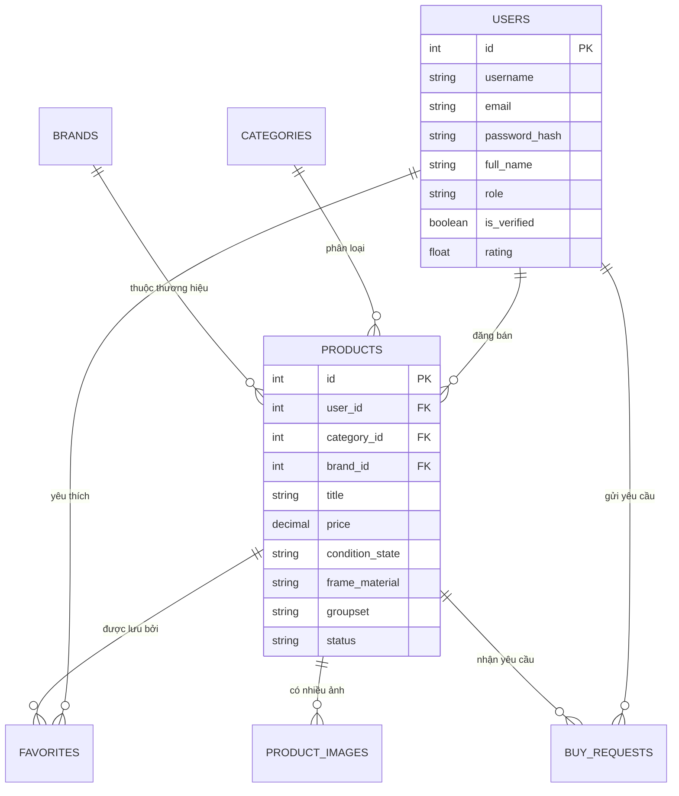

<p align="center">
  
</p>

<h1 align="center">🚲 Bike Marketplace</h1>

<p align="center">
  <strong>Nền tảng mua bán xe đạp thể thao chuyên nghiệp — Kết nối người mua và người bán trong cộng đồng xe đạp Việt Nam</strong>
</p>

<p align="center">
  
  
  
  
  
</p>

---

## 🎯 Giới thiệu

**Bike Marketplace** là một nền tảng web fullstack cho phép người dùng mua bán xe đạp thể thao đã qua sử dụng. Hệ thống được xây dựng với kiến trúc **Frontend–Backend tách biệt**, giao tiếp qua **RESTful API** và triển khai hoàn toàn bằng **Docker**.

### ✨ Tính năng chính

| Tính năng | Mô tả |
|---|---|
| 🔐 **Xác thực JWT** | Đăng ký, đăng nhập với token bảo mật |
| 📋 **Quản lý tin đăng** | Tạo, chỉnh sửa, xóa sản phẩm với nhiều ảnh |
| 🛡️ **Duyệt bài (Admin)** | Admin có thể duyệt/từ chối sản phẩm trước khi hiển thị |
| 🔍 **Tìm kiếm & Lọc** | Lọc theo thương hiệu, loại xe, tình trạng, khu vực, giá |
| 📩 **Buy Request** | Người mua gửi yêu cầu mua, người bán phản hồi |
| ❤️ **Yêu thích** | Lưu và quản lý danh sách xe yêu thích |
| 👤 **Hồ sơ cá nhân** | Xem và cập nhật thông tin, quản lý tin đăng |
| 📊 **Thông số kỹ thuật** | Chi tiết về groupset, khung xe, kích thước bánh, phanh |

---

## 🏗️ Kiến trúc hệ thống

```
┌─────────────────────────────────────────────────────────┐
│                     DOCKER NETWORK                      │
│                                                         │
│  ┌──────────────┐    ┌──────────────┐    ┌───────────┐  │
│  │    Nginx     │───▶│   PHP-FPM    │───▶│   MySQL   │  │
│  │  Port: 8888  │    │  (Backend)   │    │ Port:3306 │  │
│  └──────────────┘    └──────────────┘    └───────────┘  │
│         │                  │                            │
│  Serve Frontend       RESTful API                       │
│  (PHP pages)        /api/v1/...                         │
└─────────────────────────────────────────────────────────┘
```

---

## 🗄️ Mô hình cơ sở dữ liệu



---

## 🛠️ Công nghệ sử dụng

| Tầng | Công nghệ |
|---|---|
| **Frontend** | PHP (template), HTML5, CSS3 (Vanilla), JavaScript (Vanilla) |
| **UI Library** | Bootstrap 5, Font Awesome |
| **Backend** | PHP 8 — RESTful API (không framework) |
| **Database** | MySQL 8.0 |
| **Auth** | JWT (JSON Web Token) + bcrypt |
| **DevOps** | Docker, Docker Compose, Nginx, PHP-FPM |

---

## 📂 Cấu trúc thư mục

```
bike-marketplace/
├── backend/                    # PHP Backend — RESTful API
│   ├── config/
│   │   └── database.php        # Kết nối PDO
│   ├── controllers/
│   │   ├── AuthController.php
│   │   ├── ProductController.php
│   │   ├── BuyRequestController.php
│   │   ├── FavoriteController.php
│   │   ├── UserController.php
│   │   ├── AdminController.php
│   │   ├── BrandController.php
│   │   └── CategoryController.php
│   ├── models/
│   │   ├── User.php
│   │   ├── Product.php
│   │   ├── BuyRequest.php
│   │   ├── Favorite.php
│   │   ├── Brand.php
│   │   └── Category.php
│   ├── middleware/
│   │   └── AuthMiddleware.php  # JWT verification
│   ├── routes/
│   │   └── api.php             # Route dispatcher
│   ├── utils/
│   │   ├── JwtHelper.php
│   │   └── response.php
│   ├── uploads/                # Ảnh sản phẩm (bị gitignore)
│   └── index.php               # Entry point API
│
├── frontend/                   # Giao diện người dùng
│   ├── pages/
│   │   ├── index.php           # Trang chủ
│   │   ├── products.php        # Danh sách sản phẩm
│   │   ├── product-detail.php  # Chi tiết sản phẩm
│   │   ├── create_product.php  # Đăng bán xe
│   │   ├── user.php            # Hồ sơ cá nhân
│   │   ├── favorites.php       # Danh sách yêu thích
│   │   ├── admin.php           # Trang quản trị
│   │   ├── login.php
│   │   └── register.php
│   ├── includes/               # PHP components tái sử dụng
│   │   ├── head.php
│   │   ├── navbar.php
│   │   ├── footer.php
│   │   └── scripts.php
│   └── assets/
│       ├── css/                # Stylesheet theo trang
│       ├── js/                 # JavaScript theo module
│       └── images/             # Ảnh tĩnh (hero, categories, icons)
│
├── database/
│   ├── schema.sql              # DDL — Tạo toàn bộ bảng
│   ├── seed.sql                # Dữ liệu mẫu cơ bản
│   ├── sample_products.sql     # Dữ liệu sản phẩm demo
│   └── reset_system.php        # Script reset & tạo admin
│
├── docker/
│   ├── nginx/default.conf      # Nginx routing config
│   └── php/Dockerfile          # PHP-FPM image
│
├── docker-compose.yml          # Điều phối 3 services
├── .env.example                # Mẫu biến môi trường
└── .gitignore
```

---

## 🚀 Hướng dẫn khởi chạy

### Yêu cầu

- [Docker Desktop](https://www.docker.com/products/docker-desktop/) đã cài đặt và đang chạy

### Các bước

```bash
# 1. Clone repository
git clone https://github.com/Tluan-2510/bike-marketplace.git
cd bike-marketplace

# 2. Tạo file môi trường
cp .env.example .env

# 3. Khởi động toàn bộ hệ thống
docker-compose up -d --build
```

### Truy cập

| Service | URL |
|---|---|
| **Web App** | http://localhost:8888 |
| **API Endpoint** | http://localhost:8888/api/v1/ |
| **Database** | `localhost:3306` (user: root / pass: root) |

### Tài khoản mặc định

Hệ thống tự động seed dữ liệu qua `database/seed.sql`. Để tạo tài khoản admin hoặc reset dữ liệu:

```bash
docker exec -it bike_market_app php /var/www/html/database/reset_system.php
```

---

## 🔌 API Overview

Base URL: `http://localhost:8888/api/v1`

| Method | Endpoint | Mô tả | Auth |
|---|---|---|---|
| `POST` | `/auth/register` | Đăng ký tài khoản | ❌ |
| `POST` | `/auth/login` | Đăng nhập, nhận JWT | ❌ |
| `GET` | `/products` | Lấy danh sách sản phẩm | ❌ |
| `GET` | `/products/{id}` | Chi tiết sản phẩm | ❌ |
| `POST` | `/products` | Đăng bán sản phẩm | ✅ |
| `PUT` | `/products/{id}` | Cập nhật sản phẩm | ✅ |
| `DELETE` | `/products/{id}` | Xóa sản phẩm | ✅ |
| `POST` | `/buy-requests` | Gửi yêu cầu mua | ✅ |
| `GET` | `/buy-requests` | Xem yêu cầu của tôi | ✅ |
| `POST` | `/favorites/{id}` | Thêm/bỏ yêu thích | ✅ |
| `GET` | `/users/me` | Thông tin cá nhân | ✅ |
| `PUT` | `/users/me` | Cập nhật hồ sơ | ✅ |
| `GET` | `/admin/products` | Duyệt sản phẩm (admin) | ✅ Admin |
| `PUT` | `/admin/products/{id}` | Approve/reject sản phẩm | ✅ Admin |
| `GET` | `/brands` | Danh sách thương hiệu | ❌ |
| `GET` | `/categories` | Danh sách danh mục | ❌ |

> **Auth**: Gửi header `Authorization: Bearer <token>` với các endpoint yêu cầu xác thực.

---

## 👥 Đội ngũ phát triển

| Vai trò | Thành viên |
|---|---|
| **Frontend** | Huỳnh Văn Khánh, Nguyễn Hoàng Phương |
| **Backend** | Vạn Tường Ceasar, Nguyễn Duy Ngọc, Nguyễn Thành Luân |
| **Database & DevOps** | Phạm Văn Hưng |

---

<p align="center">Made with ❤️ for the Bike Community · Vietnam 🇻🇳</p>
