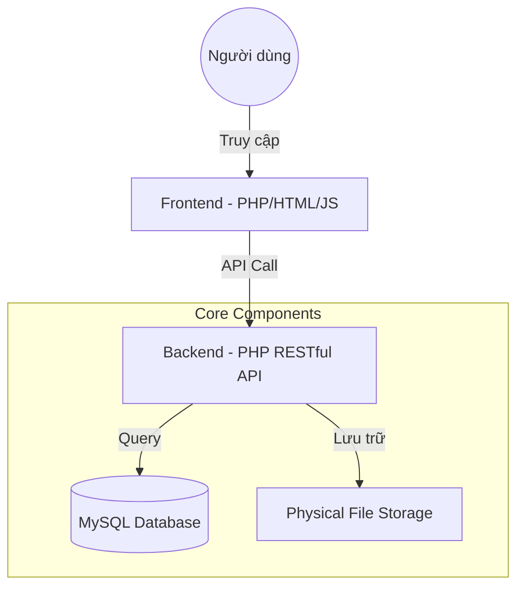
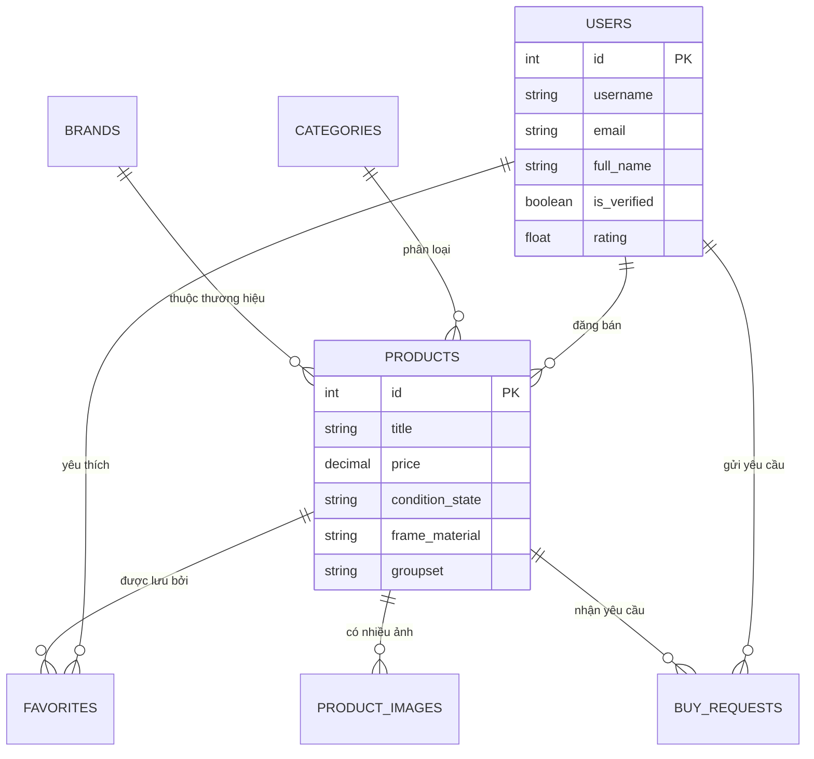

<p align="center">
  
</p>

<h1 align="center">🚲 Bike Marketplace</h1>

<p align="center">
  <strong>Nền Tảng Mua Bán Xe Đạp Thể Thao Chuyên Nghiệp</strong>
</p>

<p align="center">
  
  
  
  
</p>

---

## 🎯 Giới thiệu

**Bike Marketplace** là giải pháp kết nối cộng đồng yêu xe đạp thể thao. Chúng tôi tập trung vào việc tạo ra một môi trường giao dịch minh bạch, nơi người mua có thể tìm thấy những chiếc xe chất lượng với thông số kỹ thuật chi tiết nhất, và người bán có thể tiếp cận đúng đối tượng khách hàng.

### ✨ Tính năng nổi bật

- 🔍 **Tìm kiếm thông minh**: Lọc xe theo thương hiệu, loại xe, tình trạng và khu vực.
- 📊 **Thông số chuyên sâu**: Cung cấp chi tiết về Group-set, khung xe, kích thước bánh và phanh.
- 📸 **Thư viện hình ảnh**: Hỗ trợ nhiều góc chụp giúp đánh giá chính xác tình trạng xe.
- 📩 **Thương lượng trực tiếp**: Hệ thống "Buy Request" giúp người mua và người bán dễ dàng trao đổi giá.
- ✅ **Xác minh uy tín**: Hệ thống tích xanh và đánh giá giúp tăng độ tin cậy.

---

## 🏗️ Kiến trúc hệ thống

Dưới đây là sơ đồ luồng hoạt động của hệ thống:



---

## 🗄️ Thiết kế Cơ sở dữ liệu

Hệ thống được thiết kế chuẩn hóa để tối ưu hóa việc quản lý dữ liệu xe đạp:



---

## 🛠️ Công nghệ sử dụng

| Layer | Technologies |
| --- | --- |
| **Frontend** |    |
| **Backend** |  (RESTful API) |
| **Database** |  |
| **DevOps** |   |

---

## 🚀 Hướng dẫn khởi chạy

### 1. Sử dụng Docker (Khuyên dùng)
Yêu cầu: Đã cài đặt Docker & Docker Compose.
```bash
docker-compose up -d --build
```
Hệ thống sẽ tự động khởi tạo:
- **Web App**: `http://localhost:8080`
- **Database**: Cổng `3306`

### 2. Cài đặt thủ công (XAMPP)
Vui lòng tham khảo file chi tiết: [📄 SETUP.md](file:///c:/Users/ntlxx/OneDrive/Desktop/Web/bike-marketplace/SETUP.md)

---

## 👥 Đội ngũ phát triển

| Role | Thành viên |
| --- | --- |
| **Frontend** | Huỳnh Văn Khánh, Nguyễn Hoàng Phương |
| **Backend** | Vạn Tường Ceasar, Nguyễn Duy Ngọc, Nguyễn Thành Luân |
| **Database & DevOps** | Phạm Văn Hưng |

---

## 📂 Cấu trúc thư mục

```text
.
├── backend/            # PHP API & Business Logic
├── frontend/           # Giao diện người dùng & Assets
├── database/           # SQL scripts & Schema
├── docker/             # Docker configuration files
└── docker-compose.yml  # File điều phối container
```

---

<p align="center">
  Made with ❤️ for the Bike Community
</p>
